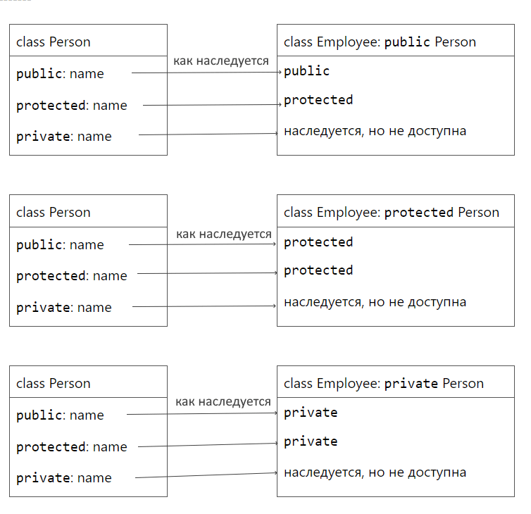

# Урок 4: Шаблоны, наследование и структуры на основе Vector.
[К главному описанию](/README.md)


## Краткий план
1. Зачем нужны шаблоны и как они разбиваются на файлы.
2. Stack на основе Vector: наследование.
3. Queue с помощью двух Stack как полей класса.


## Мотивация
Вроде бы мы справились сделать Vector, хранящий int. А что если нам понадобится хранить string, float, double, long long, char - под всё это заново класс писать что-ли?! К счастью нет, и в C++ для этих целей придуманы шаблоны.


## Как работать с шаблонами
В объявлении класс (`.h` файл) сразу над классом добавляем и над функцией вывода:
```cpp
template<typename T>
```
И внутри объявления класс меняем используем `T` как тип, хранимый в векторе.

В реализации класса (`.cpp` файл) перед каждым методом нужно добавить:
```cpp
template<typename T>
```
И заменить `Vector` на `Vector<T>` везде, где имеется ввиду тип данных (то есть все места, кроме названия конструктора и деструктора).

И наконец переименовываем `vector.cpp` в `vector.tpp` и добавляем в конце `vector.h` строку:
```cpp
#include "vector.tpp"
```
Подключать файл в заголовочный нужно так как шаблонный класс должен подключаться в другие файлы целиком (вместе с реализацией всех методов), а поменяли расширение мы для того, чтобы отличать файл с настоящим кодом от файла с шаблоном кода (у MSWord сделано также: для обычных файлов и файлов с шаблоном стиле используются разные расширения).


## Стек
Стек - это такая структура данных, которая позволяет только добавлять и удалять элемент из конца, обращаться к последнему элементу. По сути это только часть функционала, которую мы уже сделали в Vector, и зачем мы вообще останавливаемся на стеке? Это может показаться странным, но на практике люди любят искусственно ограничить себе возможности: если вы хотите использовать только функционал стека, то хочется использовать отдельный класс для стека, а не использовать вектор - так код упрощается для чтения и потенциально может стать эффективнее от использования структуры данных умеющей меньше. Но хоть структура и простая, но мы постараемся максимально усложнить себе жизнь!

Мы уже познакомились с инкапсуляцией, когда рассматривали модификаторы доступа. Теперь настало время рассмотреть наследование. Представим, что мы хотим в классе `Child` сделать примерно тоже самое, что делали в классе `Parent` но с какими-то отличиями. Тогда мы можем унаследовать `Child` от `Parent` и поменять только нужные функции. Это хорошая практика, так как позволяет уменьшить объём кода в отличие от полного копирования всех методов. В C++ придумали несколько видов наследования:
```cpp
class Child : public Parent;
class Child : protected Parent;
class Child : private Parent;
```
Если не указать модификатор, то по умолчанию используется `private` (а для `struct` используется `public`). Общая схема того, как наследуются поля:



Когда в `Child` мы хотим использовать метод `method` унаследованный из `Parent`, то его можно вызвать через `Parent::method`.

Для стека мы хотим приватно унаследоваться от вектора и переименовать методы в `push`, `top`, `pop`. Деструктор у нас ничего делать не будет, так как C++ сам вызывает деструктор родительского класса. Обращение по индексу, методы `begin` и `end`, операцию вывода тоже можно определить, но они не очень осмысленны к структуре с возможностью доступа только к последнему элементу.

Ещё из приятных фактов стоит отметить, что конструктор копирования и оператор присваивания можно определять, а довериться в их создании компилятору. Компилятор справляется сам сгенерировать эти методы, если в самом классе не хранится что-то сложное (в нашем случе в Vector хранилась `data` и мы следили чтобы она правильно копировалась, в Stack же ничего не хранится и компилятор сгенерирует функции через копирования в Vector).

Но если очень хочется, то можно определить конструктор и вызывать в нём родительский конструктор, например вот такой код допустим:
```cpp
template<typename T>
Stack<T>::Stack() : Vector<T>::Vector() {}      // Вызываем родительский конструктор без аргументов
```


## Очередь
Теперь мы перейдём к такой структуре, как очередь (Queue). Функционал у очереди тоже довольно маленький: можно добавить элемент в конец и взять из начала. И очередь можно реализовать с помощью двух стеков `left` и `right`
- При добавлении элемента добавляем его в `right`.
- Если мы удаляем элемент и `left` пустой, то перекладываем все элементы из `right` в `left` и переходим к следующему шагу.
- Если мы удаляем элемент и `left` не пустой, то удаляем из `left`.

Понятно, что очередь не нужно не от чего наследовать, так как левая и правая части достаточно равнозначны. Поэтому в очереди будем хранить два стека. Все методы определяются по описанию выше, разве что вынести перекладывание всех элементов из `right` в `left` можно в отдельную функцию `move_stack` (она должна быть `private`), чтобы кто попало её не вызывал.

Кроме того стоит отметить, что метод `front` пришлось сделать неконстантным, так как если `left` пуст, то мы не можем достать элемент снизу `right`. В целом это можно обойти, если никогда не оставлять `left` пустым, или добавить метод в стек. То есть ограничения на некоторые методы бывают вызваны внутренним устройством структуры и это нормально.
