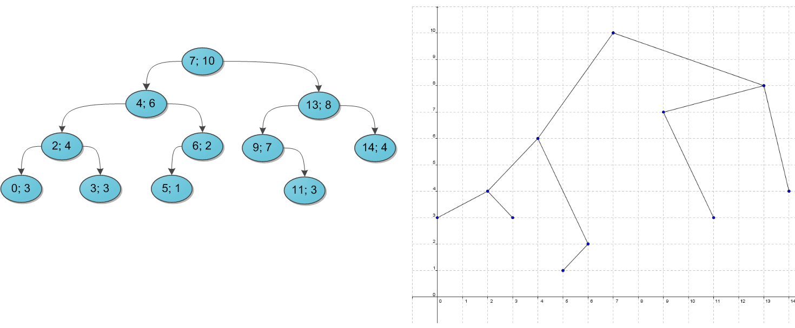

# Урок 9: Декартово дерево, обычное и по неявному ключу.
[К главному описанию](/README.md)

## Краткий план
1. Как работает Декартово дерево.
2. Декартово дерево по неявному ключу (с операцией суммы на отрезке).

## Мотивация
Конечно rbst структура хорошая, но в тех же олимпиадах люди предпочитают писать декартовые деревья (ДД). Не очень понятно, с чем связаны именно такие предпочтения, наверное у ДД ожидаемая глубина меньше (но опять же только в константу раз, не асимптотически).

## Как работает Декартово дерево
Раз уж мы хотим где-то применить рандом, то для этого давайте каждой вершине присваивать свой случайный приоритет. И потом с помощью этого приоритет реализуем `Merge`: корнем станет та вершина, у которой приоритет больше. Такую структуру принято называть Декартовым деревом, так как она очень удачно изображается на обычной декартовой плоскости:

Пишется декартово дерево в целом точно так же, как и rbst: в конструкторах добавляем генерацию приоритета, а при слиянии двух ДД используем эти приоритеты.

## Декартово дерево по неявному ключу (с операцией суммы на отрезке)
Представим, что перед нами стоит такая задача: дан какой-то массив и поступают запросы добавления и удаления элемента по индексу, а также запрос суммы на отрезке. При этом разрешается все операции реализовывать за $O(\log n)$.

Идея такая: откажемся от ключей и вместо них будем хранить в каждой вершине размер её поддерева. Тогда при операции `Split` будем пользоваться этими размерами, а `Merge` будем делать точно так же, как и раньше, с помощью приоритетов, сохранённых в вершинах.

К сожалению (или к счастью), данная модификация достаточно сильно отличается от остальных реализованных структур, поэтому придётся снова всё скопировать и немного исправить: часть из bst (split), часть из rbst (update) и часть из treap (merge).

Кроме того замети, что в декартово дерево очень легко можно добавить обработку каких-то запросов на отрезке. Для этого в вершине будем хранить нужную величину (например сумму в поддереве), и внутри функции `update` будем эту величину пересчитывать (а `update` вызывается, когда в поддереве что-то поменялось).
